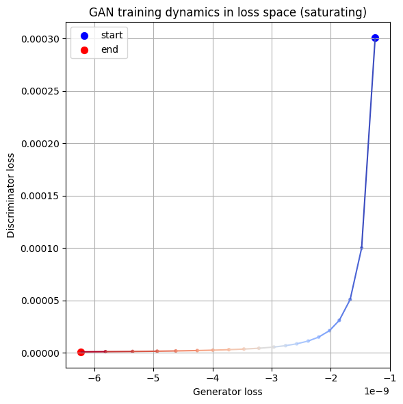
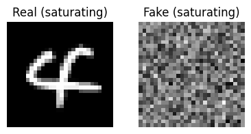
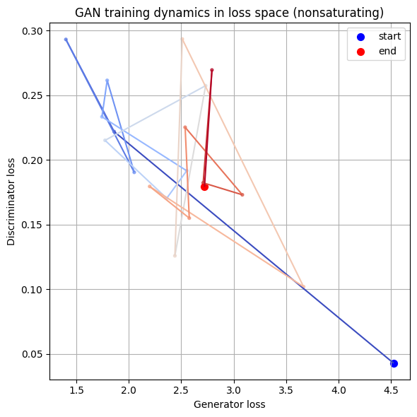
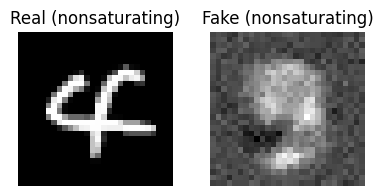

# The non-saturating loss function in GANs

## Question

Why does the non-saturating version of the GAN loss function improve convergence? 

## Idea

GANs, as an adversarial training approach, share many of the same convergence problems as UED - so it's worth understanding the convergence tricks that were used in GANs in case they can help us improve the convergence of agent and environment designer in UED. 

Goodfellow's original GAN paper ([2014](https://arxiv.org/abs/1406.2661)) advocated replacing the default minimax objective for the generator ("maximise the loss of the discriminator") with an alternative "non-saturating" loss function - but the justification was "heuristically-motivated" (see his [2016 tutorial](https://arxiv.org/abs/1701.00160)). Understanding this non-saturating approach at a deeper level might help us work out whether a similar approach could help in UED.

## The problem with the original minimax approach

- For the logistic function, the gradient of the negative log-likelihood gets stronger the further away the predictions π are from the target y.

  - That is, it's proportional to the raw residuals (y - π) (see below).

  - Example: for generated fakes (y = 0), the gradient is strongest when π ≈ 1 and weakest as π approaches 0.

  - So, the better the discriminator's predictions, the weaker its gradient.

- At the start of training:

  - The generator produces a distribution that's far from the real data manifold.

  - This makes the discriminator's task easy, so it quickly learns to match its predictions to the labels:  
    - (π | y = 1) → 1  
    - (π | y = 0) → 0

  - As a result, the discriminator's gradient → 0.

- Problem: in the minimax approach, this also causes the generator's gradient to vanish.

  - The generator's gradient passes through the discriminator's gradient:
  $$
  \frac{\partial \ell}{\partial \theta}
  = \frac{\partial \ell}{\partial \eta}
    \frac{\partial \eta}{\partial x}
    \frac{\partial x}{\partial \theta}
  = (y - \pi)\,\beta^\top \frac{\partial x}{\partial \theta}
  $$
  
  ...where $x$ is the input data, $\theta$ the generator's parameters, $\eta$ the discriminator's parameters, $\beta$ the discriminator's final layer weights (shown as a linear model for simplicity), $\pi$ the discriminator's predicted probability that the sample is real, and $y$ the target label.

  - So, even if it changes the pixel distribution $x$, it finds it hard to affect the discriminator's likelihood because (y - π) is so small.

## The "non-saturating" trick

- We flip the generator’s labels so that, from its perspective, the discriminator’s predictions are far from the target.

- Thus, the closer the discriminator gets to its own target, the larger (y - π) becomes, and the stronger the generator's gradient.

- This changes the generator’s loss dynamics (how it approaches equilibrium), but the equilibrium remains the same.

**Things to note**

- This approach requires that the generator's labels are the opposite of the discriminator’s labels.

  - Flipping both sets of labels (e.g. making the discriminator predict "probability of fake") doesn’t work, because then the generator’s gradient would still vanish as the discriminator gets closer to its own target.

- It could be more accurately called the "asymmetric labelling" trick rather than the "non-saturating loss" trick.

  - Having asymmetric labels is only "non-saturating" for the generator when the discriminator is on the saturated part of its loss gradient.

  - If instead the discriminator starts with the exactly wrong predictions, losses would be non-saturating, and the trick would make things worse.

## Illustration

We compared the saturating and non-saturating loss functions in the [gan_nonsaturating_loss](../../experiments/gan/gan_nonsaturating_loss.ipynb) notebook. The non-saturating version oscillates towards something that looks like a real MNIST digit, whereas in the saturating version, the generator never gets started.

```python
def cross_entropy_loss_single_label(logits, label):
    targets = jnp.full_like(logits, label)
    return optax.sigmoid_binary_cross_entropy(logits, targets).mean()

def generator_loss_nonsaturating(logits_real_given_fake):
    """Objective: maximise p(predicted real | fake)"""
    return + cross_entropy_loss_single_label(logits=logits_real_given_fake, label=1)

def generator_loss_saturating(logits_real_given_fake):
    """Objective: minimise p(predicted fake | fake)"""
    return - cross_entropy_loss_single_label(logits=logits_real_given_fake, label=0)

def discriminator_loss(logits_real_given_real, logits_real_given_fake):
    loss_given_real = cross_entropy_loss_single_label(logits=logits_real_given_real, label=1)
    loss_given_fake = cross_entropy_loss_single_label(logits=logits_real_given_fake, label=0)
    return (loss_given_real + loss_given_fake) / 2
```






## Implications

- To achieve convergence in GANs, and by extension in UED, we want objective functions that maintain a strong gradient for one agent even when the other agent has closed in on its target - convergence for one agent should not halt training for the other.

- This might involve redefining the agents' objective functions in a way that changes the convergence dynamics but not the equilibria - as with this non-saturating GAN approach.

- In other words, we may need to consider situations where the agent and environment designer have different value functions, such that the game is _no longer a true minimax_.

- This could strengthen the link to evolutionary game theory, which is not typically a minimax game - but we'd need to think about whether changing the convergence stability of an evolutionary game would destroy the notion of an evolutionarily stable strategy (_sensu_ McGill & Brown 2007).