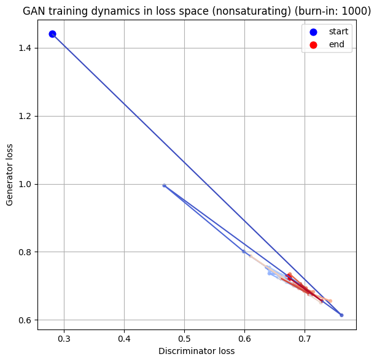
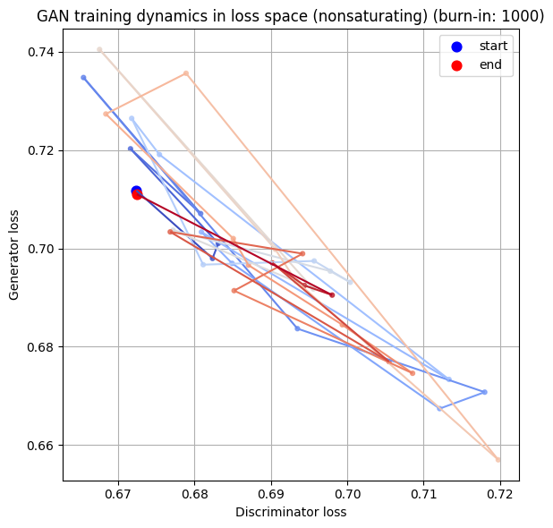
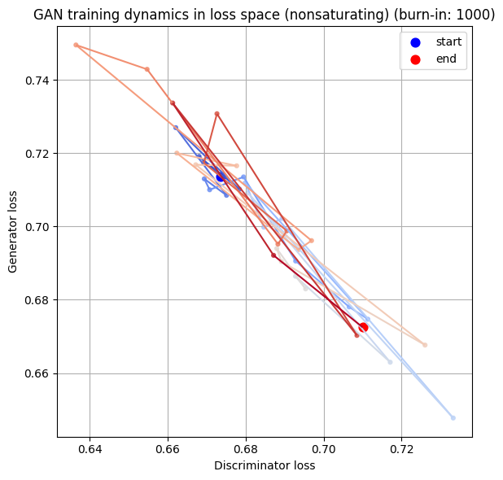
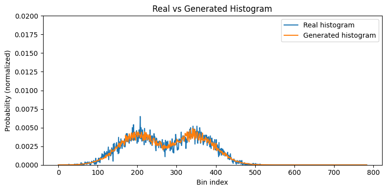
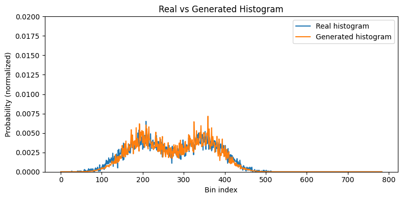
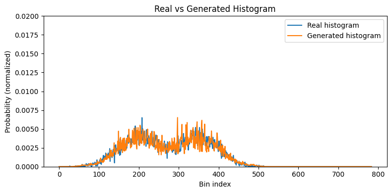
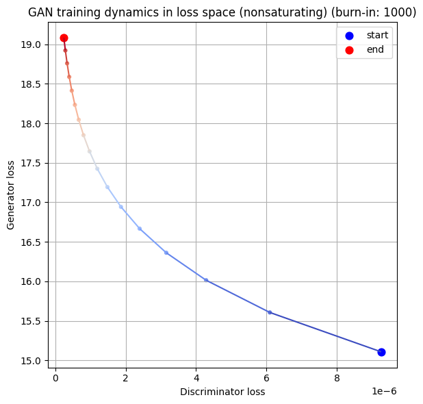
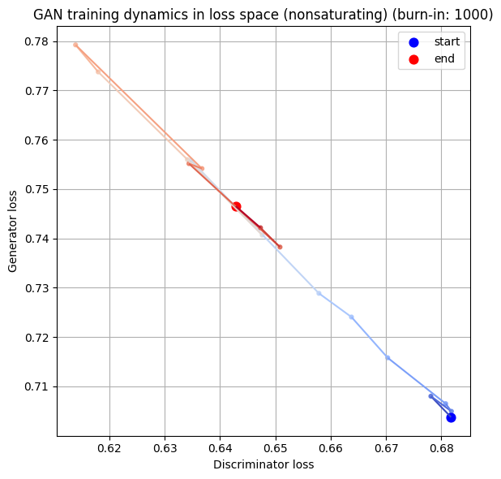
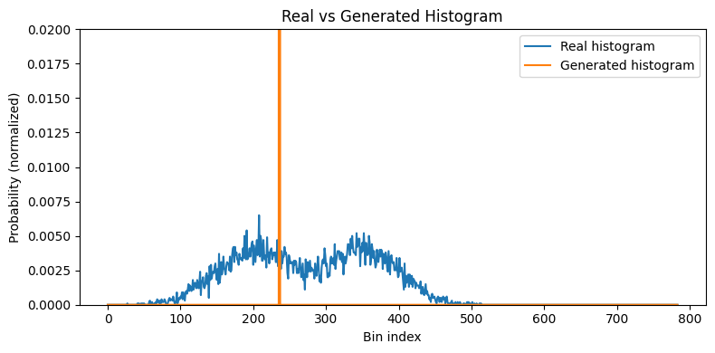
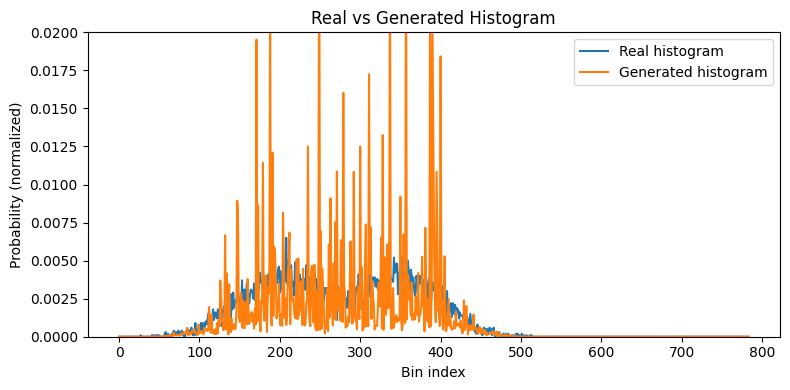

# Constraints in GANs

## Question

How do constraints affect training dynamics in GANs?

## Idea

In ecological systems, diversity arises from *constraints*: trade-offs in fitness between different environments mean that there can be no one "Darwinian Demon" species that's optimal at everything, so species end up branching into diverse specialists. 

Here we look at how constraints affect GAN training, hoping to provide some clues on how constraints might affect UED training and diversity generation in evolutionary game theory algorithms. 

## Problems: where GAN theory fails in practice

GANs, like UED, are grounded in a minimax game in theory, but training them requires approximations which may violate the assumptions of the game in practice. 

### 1. Non-zero-sum games

For a game to be zero-sum (and thus a minimax game), both agents have to be fighting over the exact same loss quantity (one trying to increase it, the other trying to decrease it). 

If the two agents are trying to maximize different objectives, there's no guarantee they'll always push against each other in the same way, and the game is not truly minimax (see for example [The non-saturating loss function in GANs](../2025-12-17_gan-nonsaturating-loss/notes.md), also discussed in Goodfellow's NeurIPS tutorial).

There are, however, cases where such games are non-zero-sum but the minimax *equilibria* are still the same - if the points at which the two agents (minimizer and maximizer) *counterbalance* each other are the same. This is the case for the non-saturating GAN loss.

### 2. Constraints imposed by neural network representations

**Core insight:** Minimax guarantees live in *function space* (distributions and functions can be freely mixed); neural-network training operates in *parameter space* (parameterization breaks convexity). This creates two distinct failure modes:

- **Representation:** Is the equilibrium distribution even in the model class?

- **Convergence:** Even if it is, do the training dynamics get there, or do they cycle/collapse?

#### 2.1 Representation Constraints

Even if there's a mixed strategy that can perfectly generate the real data distribution in theory, there's no guarantee a single neural network can actually represent this in practice. 

In the "infinite tabular" case of the original minimax decision theory, we can blend any set of solutions however we need to concoct the unbeatable strategy. But with neural networks, we're limited in both the "pure strategy" palette we have available and the ability to do the blending—which the network has to figure out internally, as best it can.

The problem is that the set of distributions reachable by a fixed generator is generally **not closed under mixing**, even though game theory assumes you can freely mix strategies. In function space, mixing is straightforward: take half of one distribution and half of another, and you get a bimodal distribution. But with neural network parameters, if you have two settings $\theta_1$ and $\theta_2$ that produce different distributions, their mixture is not guaranteed to match any single parameter setting. Averaging the parameters doesn't average the distributions.

#### 2.2 Convergence Constraints

Even if there is a set of parameters that can generate the equilibrium distribution, *successive changes* in those parameters might not be able to reach it. Even with high expressivity, small parameter changes can only move the distribution in limited directions. Locally, it's easier to move existing mass (slide one peak around) or adjust the width of a mode, than to create a second separate peak or split mass between distant regions. The "mixing direction" needed for bimodality often isn't locally available, so single-mode solutions become stable attractors. The result is that gradient-based updates can get stuck at local stationary points, cycle endlessly, or depend heavily on initialization and step sizes.

## Experiments

We test how these representation and convergence constraints affect training:

1. **Varying latent dimensionality** – Vary the latent vector dimensionality (64, 4, 1) to explore how representation capacity affects the ability to represent a bimodal Gaussian distribution.

2. **Varying learning rates** – Vary the learning rate (low, med, high) for 1D latent vectors to see how optimization dynamics affect convergence.

### Experiment 1: Representation limits

Here we limit the size of the GAN neural network and see if it affects an ability to converge to a known GAN, namely a mixed Gaussian / bimodal distribution. In particular, we vary the *latent vector*, which provides raw material for generation, similar to the dimensionality of the environment in an ecological system. (We also have varied the generator network's *architecture* but choose not to do that here).

**Training dynamics** for each latent dimensionality (lr=$10^{-3}$):

**Dim $z = 64$**

**Dim $z = 4$**

**Dim $z = 1$**

**Sample histograms** for the same runs:

**Dim $z = 64$**

**Dim $z = 4$**

**Dim $z = 1$**

### Experiment 2: Convergence limits

Now, we vary the learning rate to test how optimization dynamics affect the generator's ability to reach equilibrium when representation capacity is limited (1D latent).

**Training dynamics** for each learning rate (dim $z = 1$):

**Low lr=$10^{-4}$**

**Med lr=$10^{-3}$**

**High lr=$10^{-2}$**

**Sample histograms** for the same runs:

**Low lr=$10^{-4}$**

**Med lr=$10^{-3}$**

**High lr=$10^{-2}$**

## Conclusions

Both experiments showed how constraints lead to GANs missing the minimax equilibrium - but not in the way I expected!

**Representation limits:** The generator performed *better* with fewer latent dimensions (1D > 4D > 64D). This is counterintuitive - bigger isn't always better. 

A larger latent space gives more flexibility, but increases the risk of generating samples outside the "safe basin" where the discriminator accepts them. The easiest way to reduce that risk is to ignore most of z and output a conservative, average-looking sample. Result: bigger latent spaces lead to more mode collapse, not less.

**Convergence limits:** Simultaneously changing both generator and discriminator learning rates by the same factor derails the learning dynamics and prevents convergence. A given change in learning rate has different effects on the discriminator and generator, because their tasks have asymmetric difficulty levels: the discriminator finds it easy to locate the separation manifold early, while the generator needs to experiment wildly to stumble on anything that works. 

## Take-home and links to ecology

- The effects of model complexity constraints can look very different early in training, where neither model is competent, compared to effects near equilibrium. It may be worth examining both regimes in our evolutionary game theory experiments: far from equilibrium and close to a known equilibrium.

- A given change in learning rates may have different effects on the discriminator and generator. We should therefore be aware that any effects of *relative* learning rates may change depending on which absolute learning rate we set as the baseline. 

- Higher-dimensionality latent vectors may paradoxically lead to mode collapse: giving the model too many "dials" can lead to it not wanting to touch any of them for fear of being "found out". Lower-dimensionality latent vectors mean fewer dials and give the model more confidence that it can vary its outputs in natural-looking way. 

- McNamara's convexity assumption from evolutionary game theory might not hold in deep learning - in other words, there may be a "mixing cost" to evolutionary bet-hedging in neural networks that is not assumed by McNamara's model. We may be able to mitigate this cost with e.g. an explicit gating model to select different sub-networks in the policy - or by selecting from a population of policies. 

## Notes

The idea of plotting the dynamics in phase space was inspired by [Lilian Weng](https://lilianweng.github.io/posts/2017-08-20-gan/)'s use of a Lotka-Volterra-equivalent model to illustrate the "Red Queen" dynamics of GAN training.

